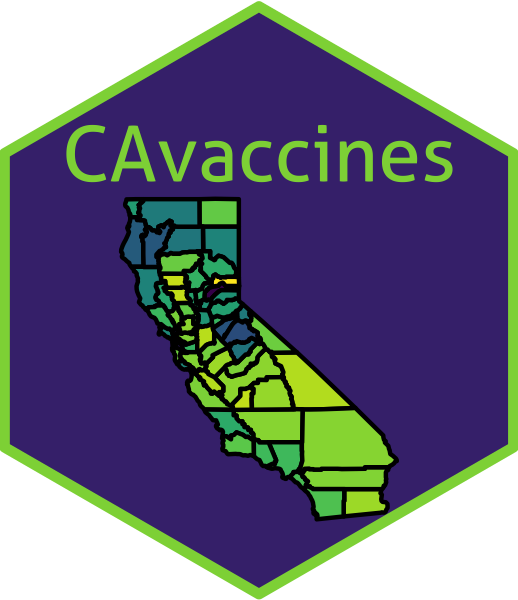

<!-- README.md is generated from README.Rmd. Please edit that file -->

```{r, include = FALSE}
knitr::opts_chunk$set(
  collapse = TRUE,
  comment = "#>",
  fig.path = "man/figures/README-",
  out.width = "100%"
)
```


# CAvaccines <a href='https://github.com/arisp99/CAvaccines'></a>

```{r code for logo, eval = F, include = F}
## Paste this at line 190 in the vaccine_disease.Rmd file

a <- map_plot(vac_to_map, "percent_DTP", title = "DTP Vaccinations")

a <- a + theme_void() + hexSticker::theme_transparent() + theme(legend.position = "none") + labs(title = NULL)
ggsave("logo_background.png")

hexSticker::sticker(a, package="CAvaccines", 
        filename="logo.png", 
        s_x = 1, s_y = 0.8, s_width = 1.6, s_height = 1.2,
        p_size = 6.5, p_y = 1.5, p_color = "#8dd544ff", h_color = "#8dd544ff",
        h_fill = "#46307cff")
```


<!-- badges: start -->
[](https://github.com/arisp99/CAvaccines/actions)
[](https://travis-ci.com/arisp99/CAvaccines)
[](https://www.tidyverse.org/lifecycle/#stable)
[](https://opensource.org/licenses/MIT)
<!-- badges: end -->

The goal of CAvaccines is to analyze the relationship between vaccination rates
and infectious disease incidence in California counties.

## Installation
To install the package, please run the code below. In order to install, devtools
must be installed and loaded.
```{r, eval = FALSE}
# install.packages("devtools")
devtools::install_github("arisp99/CAvaccines")
```

## Usage
In order to run the main script, please refer to the included vignettes. These
can also be found under the Articles tab in the website. 

### Details
#### Motivation
With the recent COVID-19 pandemic, a large number of scientists and companies
have rushed to help the world. On the forefront of everyone's mind is how can
a vaccine be developed to combat the pandemic. Vaccines play a huge role in the
world and are essential to the fight against infectious diseases. It has been
seen, time and time again, that vaccine protect against deadly pathogens and
save lives. However, disease outbreaks still occur. The reasons for these 
outbreaks are not fully understood. 

#### Aims
The aim of this package, therefore, was to provide a system for understanding
the relationship between vaccination rates and disease incidence. The package 
focuses on the state of California, USA and provides two main datasets, one 
for vaccination rates, and one for disease incidence of pertussis in California 
counties from the years of 2008 till 2017.

#### Data
The data is detailed in full in the associated help pages, but we summarize the
datasets below.

* `county_vaccination` is a dataset containing information about vaccination 
rates of K-12 students for each CA county for the years of 2008-2017. The 
dataset contains the total number of students enrolled in K-12 schools in each 
county and various vaccination rates. These include, but are not limited to, 
the number and percent of students that are up to data on vaccinations, the
number of percent of students with a personal medical exemption, the number and
percent of students with a personal belief exemption, and the number and percent
of students with an up to data DTP vaccination.
* `pertussis` is a dataset containing all pertussis cases, arranged by county, 
from the years of 2008-2017 in the state of California. The dataset contains the
number of cases and the number of cases per 100,000 people for every county and
every year.

